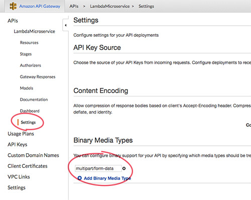

# lambda-multipart

A simple multipart/form-data parser for AWS lambda functions.

```sh
npm install -S lambda-multipart
```

```js
var Multipart = require('lambda-multipart');

exports.handler = function(event, context, callback){

  var parser = new Multipart(event);

  parser.on('field',function(key, value){
    console.log('received field', key, value);
  });
  parser.on('file',function(file){
    //file.headers['content-type']
    file.pipe(fs.createWriteStream(__dirname+"/downloads/"+file.filename));
  });

  parser.on('finish',function(result){
    //result.files (array of file streams)
    //result.fields (object of field key/values)
    console.log("Finished")
  });
}
```

## AWS Setup
There is a small bit of setup on the AWS side. Head to the API Gateway service you want to setup and select:

  **Settings** > **Binary Media Types**

Add a new entry for `multipart/form-data`  




### Credits and Acknowledgements
- [@hapijs](https://github.com/hapijs) for https://github.com/hapijs/pez
- [@myshenin](https://github.com/myshenin) for https://github.com/myshenin/aws-lambda-multipart-parser
